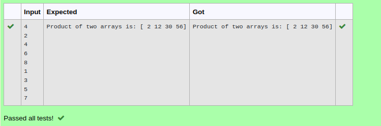

# Multiplying-two-matrix

## AIM:

## ALGORITHM:

### Step 1:
Use import numpy as np
### Step 2:
Enter the input
### Step 3:
Use append()
### Step 4:
use to multiply two matrix
### Step 5:
print

## PROGRAM: 
```python

import numpy as np
n= int(input())
l1,l2=[],[]
for i in range(n):
    l1.append(int(input()))
for i in range(n):
    l2.append(int(input()))
a=np.array(l1)
b=np.array(l2)
c=a*b
print("Product of two arrays is:",c)
```
## OUTPUT:


## RESULT:
Thus the above program is executed successfully...

